  

   &nbsp;&nbsp;
   &nbsp;&nbsp;
   &nbsp;&nbsp;
  

  
    Havrard Aspire &nbsp;·&nbsp; 
    Oxford AI Society &nbsp;·&nbsp; 
    NSF IAIFI &nbsp;·&nbsp;
  

  

    [▶] RESEARCH MANIFOLD: VIEW_LATENT_REPRESENTATIONS
  

  

    <pre style="line-height: 2; color: #444; font-size: 12px; font-family: monospace; margin: 0;">
01 // Deep Generative Modeling
02 // Physics-Informed Machine Learing
03 // GEOMETRIC Deep Learning
04 // Computational Neuroscience
05 // Quantum Information Theory 
    </pre>
  

🎧 THE FREQUENCY: AQUATIC STATE
  

    wonyoung jk jay proper obsessed fr.
  

  <h2 style="margin: 0; font-weight: 300; letter-spacing: 2px; color: #000;">
    AQUAMAN — JAY PARK (PROD. CHA CHA MALONE)
  </h2>

  

    "Low-key focused, high-key locked in. Respect the frequency."
  

  

  <code style="color: #bbb; font-size: 10px; letter-spacing: 1px;">
    [SYS] 2024-2026 // IDENTITY_NAMAN_DIXIT // STATUS: ACTIVE // POST_SCIENCE_ERA
  </code>

